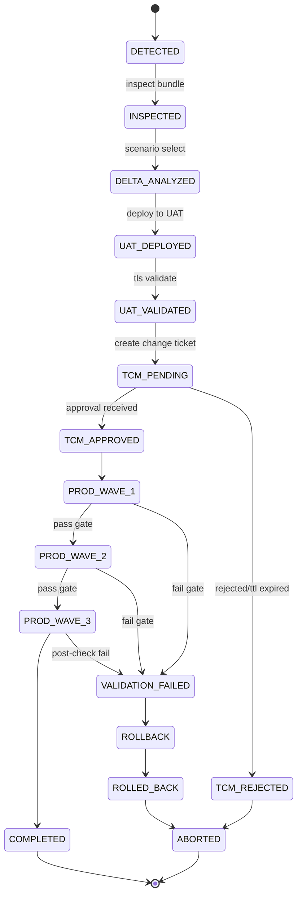

# Eraser Diagram-as-Code: NetScaler SSL Certificate Automation

Paste the following into a new **Diagram** in [app.eraser.io](https://app.eraser.io/).

```mermaid
flowchart TD
    %% External systems
    SCV[(Secure Credential Vault)]
    ADM[Citrix ADM / NITRO API]
    ITSM[ServiceNow / Jira (TCM)]
    ADC[(Citrix ADC Fleet ~250)]
    DNS[(Target Endpoints)]
    Notify[SMTP / Teams Notifier]
    Store[(Redis / PostgreSQL State Store)]

    %% Core services
    O[Orchestrator\nsrc/orchestrator.py]
    I[Inspector\nsrc/inspector/inspector.py]
    D[Delta Engine\nsrc/delta/delta_engine.py]
    E[Wave Executor\nsrc/executor/wave_executor.py]
    V[TLS Validator\nsrc/validator/tls_validator.py]
    TCM[TcmManager / TcmPoller\nsrc/tcm/*]
    N[Notifier\nsrc/notifier/notifier.py]

    SCV -->|new cert bundle| O
    O --> I
    I -->|chain + SAN + date checks| D
    D -->|Scenario A: leaf swap\nScenario B: full chain| E

    E -->|build + submit config_job| ADM
    ADM -->|deploy cert/key + bind| ADC

    E -->|persist run state| Store
    O -->|read/write state| Store
    TCM -->|read/write state| Store

    E -->|UAT rollout| V
    V -->|TLS handshake + chain depth| DNS

    V -->|pass| TCM
    V -->|fail| RB[Rollback]
    RB --> ADM

    TCM -->|create/poll ticket| ITSM
    ITSM -->|approved| W1[Wave 1 (5%)]
    ITSM -->|rejected/expired| AB[Aborted]

    W1 -->|gate: >1 fail => halt| W2[Wave 2 (25%)]
    W2 -->|gate: >3 fail => halt| W3[Wave 3 (100%)]
    W3 --> C[Completed]

    C --> N
    AB --> N
    N --> Notify
```

## Optional: State-machine focused diagram


